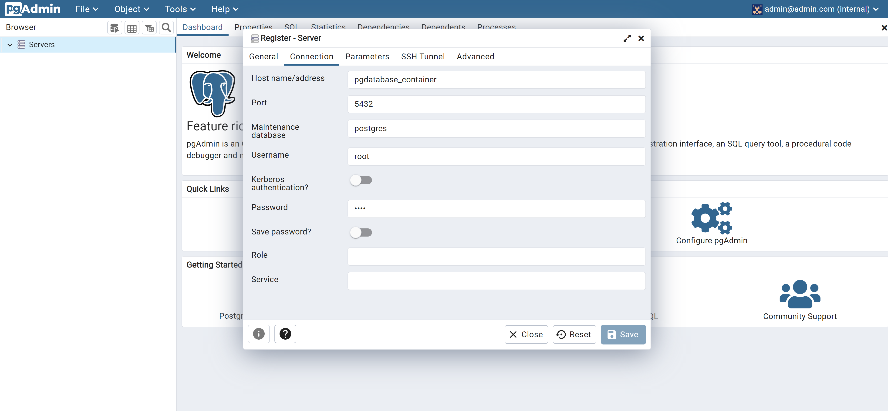
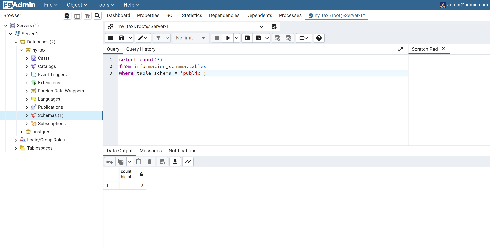
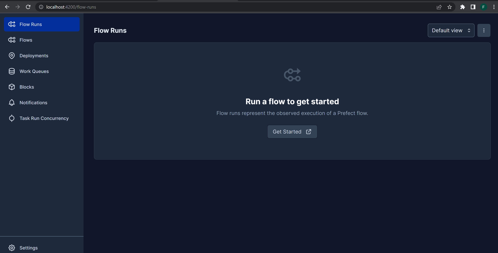
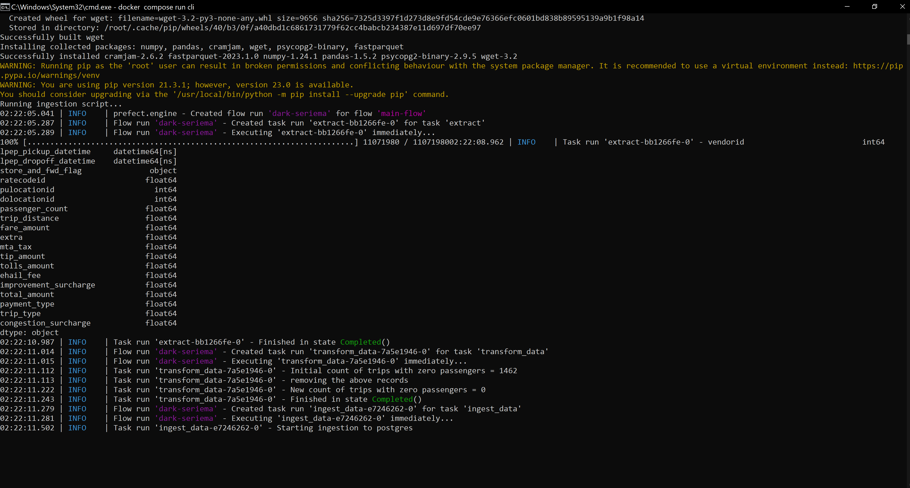
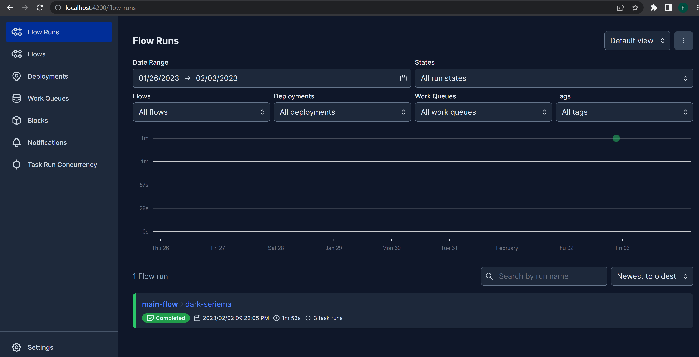
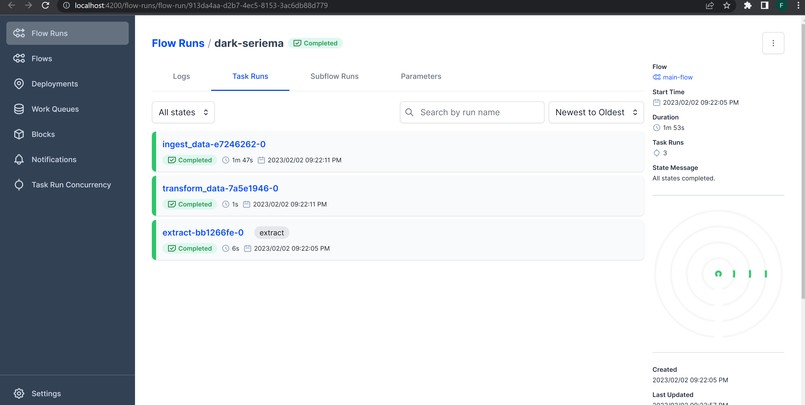
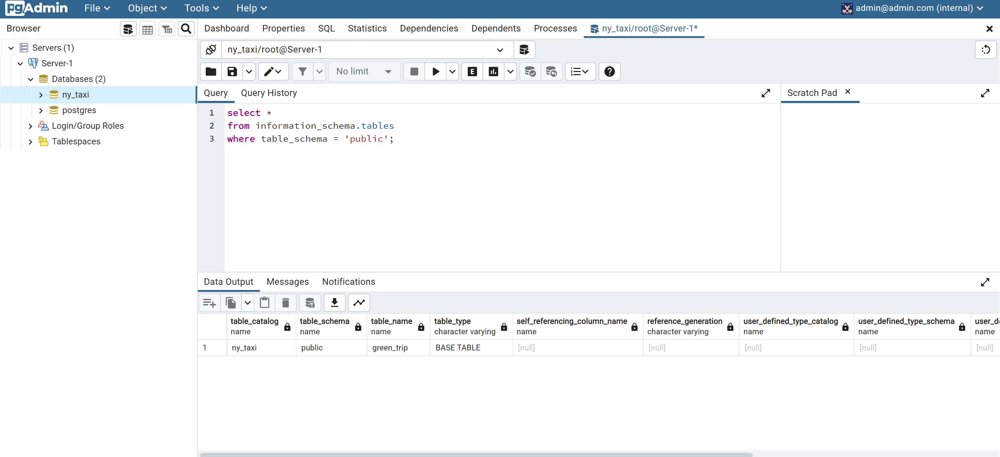

# nyc-taxi-ingestion

The Dockerized Data Pipeline performs the following tasks:

1. It retrieves taxi trips record dataset from the [NYC Taxi website](https://www.nyc.gov/site/tlc/about/tlc-trip-record-data.page) in the form of a parquet file.

2. The dataset undergoes preliminary cleaning.

3. The processed data is then ingested into a PostgreSQL database.

4. A Prefect container is created to display the workflow user interface for the ingestion script.

5. A container running pgAdmin is set up to carry out additional data cleaning using SQL commands.


## Nyc Data pipeline with Docker Compose

This repository contains everything needed to run Prefect Orion, a Python ingestion script, Postgres database and pgadmin using Docker Compose. 


### Setting up Postgres and Pgadmin Containers
There are 2 directories in this repository.

The nyc-taxi directory contains the `docker-compose.yml` file required to run the following services:
* `database` - Postgres database for the taxi data.
* `pgadmin` - Provides UI to interact with the database.
* `prefect orion server` - Provides UI to view data ingestion workflow.
* `cli` which runs the ingestion script.

The directory also contains a subfolder "flows" which houses the following:
* `ingestion.py` which contains the python script for ingestion.
* `docker-entrypoint.sh` which contains the required command line prompts to run the script
* `requirements.txt` which contains the python modules required for a successful ingestion.


To run the PostgreSQL and pgadmin UI, I opened a terminal to run:

```
docker compose --profiles pgdatabase --profiles pgadmin up
```

This will start PostgreSQL and pgadmin.

```
postgres-pgadmin-container-pgdatabase-1  | 2023-02-03 02:10:18.373 UTC [1] LOG:  database system is ready to accept connections
```

Navigating to the pgadmin instance at `http://localhost:5050/`

Created a server and filled the required inputs
<p align="center">
  
</p>

Afterwards queried database to count tables:
```sql 
select count(*)
from information_schema.tables
where table_schema = 'public';

```
<p align="center">
  
</p>
No table in database.

### Setting up Prefect Orion server

To run the prefect server:

Initializing the orion database profile. The orion server depends on this database to store flows, logs etc:

```
docker-compose --profile oriondb up
```
Afterwards
```
docker-compose --profile orion up
```

Then navigated to `http://localhost:4200/` to view the workflow ui.
Currently has no flows, as no script has been run.

<p align="center">
  
</p>


### Executing the ingestion script
To execute the ingestion script:

```
docker-compose run cli
```
This will install all the required modules and execute the `ingestion.py` script.
<p align="center">
  
</p>

Once the ingestion is complete, refreshed the prefect UI which now  shows workflow including successful tasks.

<p align="center">
  
   
  
</p>

Back to pgadmin to verify:
```sql 
select *
from information_schema.tables
where table_schema = 'public'
limit 10;

```

<p align="center">
  
</p>

Data is now ready for more transformation in SQL.
Plan to use DBT for transformation


